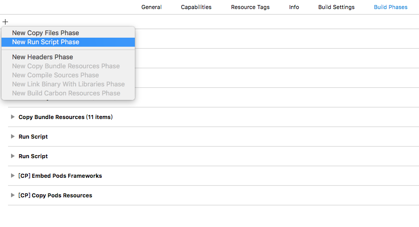
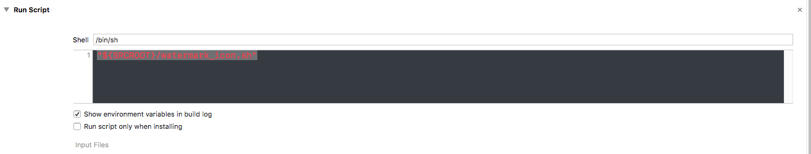

# watermark_icon.sh

## 简介

`watermark_icon.sh` 是一个可以帮助快速定位 commit 的脚本，可以用用于 Xcode Run Script 中。

`watermark_icon.sh` 可以为在 build 后将原有的图标覆盖上 `添加了 build 号、commit 的 hash 值、分支名的` 水印。


App LOGO 图片来自[花瓣](http://huaban.com/pins/571816999/)

> 此 repo 是个人练习时候写的脚本，如果需要更强大的功能，强烈推荐 [KZBootstrap, a powerful project setup aimed at high quality code.](https://github.com/krzysztofzablocki/KZBootstrap)

## 安装

1. 将 `watermark_icon.sh` 放置到 Xcode 工程目录下
2. `Build Phases` -> `New Run Script Phase` 添加 Run Script
3. shell 内容填写 `"${SRCROOT}/watermark_icon.sh"`





## 使用

Debug 或 ADHoc 下，Run 之后可以看到安装好的 App 图标已经添加了水印。

# blurmaker

## 简介

`blurmaker` 是一个为图片添加水印的 command line 工具。

## 安装

Mac OS

```
$ sudo cp blurmaker /usr/local/sbin
```

## 使用

```
$ blurmaker -i yourimage -s "your text"
```


App LOGO 图片来自[花瓣](http://huaban.com/pins/571817001/)


